# 01-auditoria-historial-git
### Repositorio --> Angular

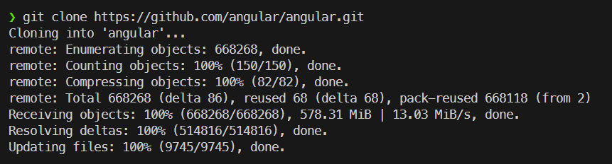

## GIT LOG

### Captura 1 --> Comando: `git log -n 10`

Este comando sirve para ver los diez ultimos commits realizados en el proyecto.

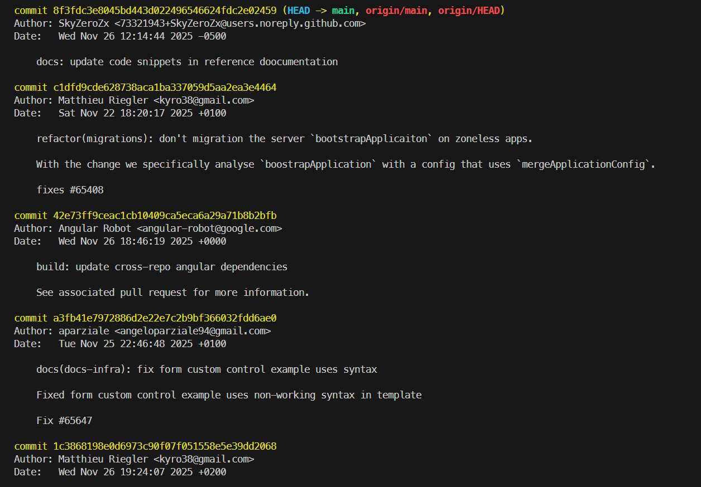

### Captura 2 --> Comando `git --no-pager log --oneline --graph -n 15`

La funcionalida de este comando es parecida al conmado anterior con la diferenia de como se muestra la informacion, en este 
caso este comado muestra solo lo "esencial" en una linea para un vistazo rapido de que se ha estado haciendo en el proyecto.
El `-n 15` se refiere a las ultimas 15 lineas del log.

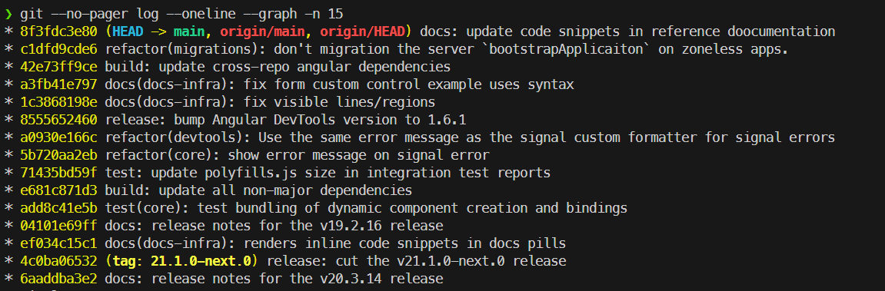

### Captura 3 --> Comando `git --no-pager log --author="Matthieu" -n 5`

Su utillidad es filtrar los ultimos cinco commits realizados por el autor en este caso Matthiu, podremos poner el nombre que queramos y nos filtrara por autor.

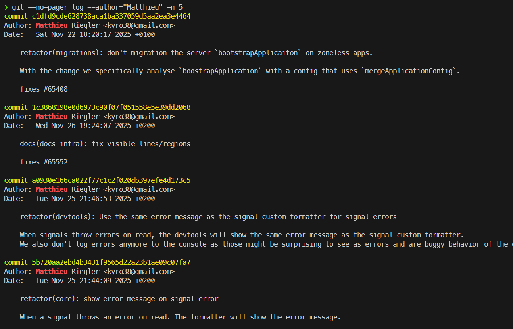

### Captura 4 --> Comando: `git --no-pager log --stat -n 5`

Este comando sirve para mostrar los ficheros modificados del commit ene ste caso con el -n 5 serian los ultimos cinco commits

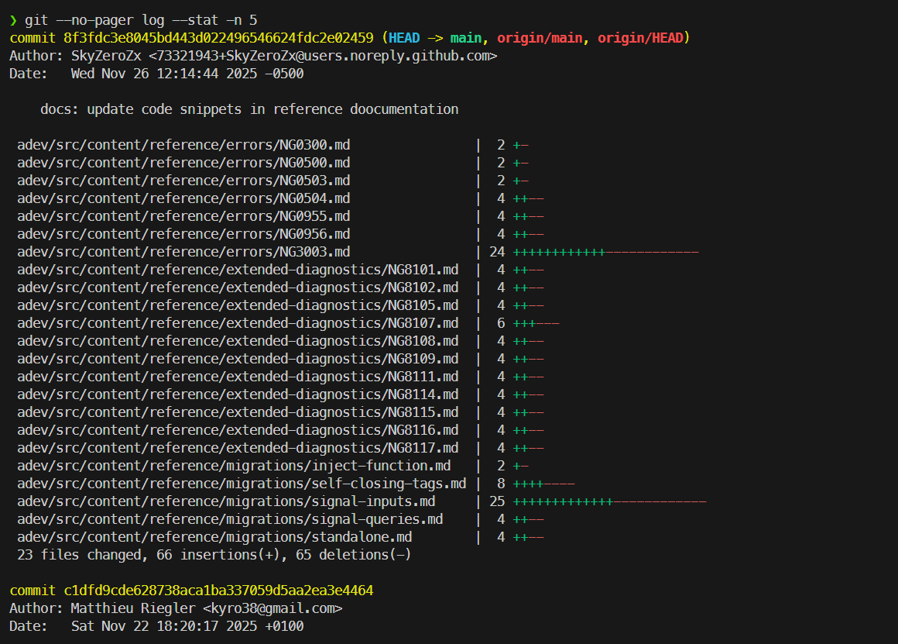

## GIT DIFF

### Captura 1 --> Comando: `git --no-pager diff HEAD~1 HEAD`

La utilidad de este comando es para comparara los cambios entre el commit actual de HEAD y el anterior a este.

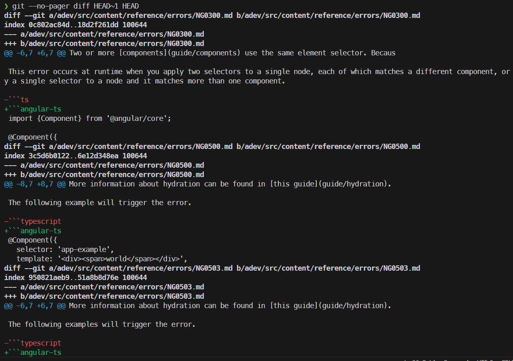

### Captura 2 --> Comando: `echo "Cambio para prueba diff" >> README.md && git diff`

Al ejecutar git diff sin argumentos, Git compara los cambios en nuestro directorio de trabajo con el último commit realizado.

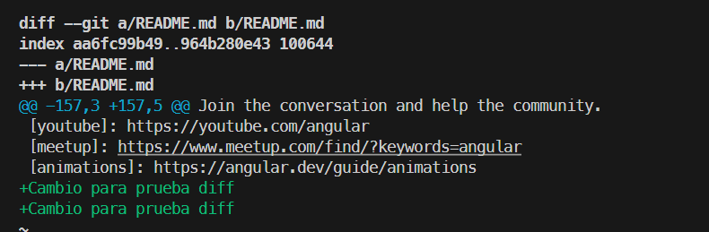

### Captura 3 --> Comando: `git add README.md && git diff --staged`

La funcionalidad es la misma que la del comando anterior solo que esta vez en vez de comparar los cambios en el directorio de trabajo con los del ultimo commit, compara los cambios de la fase staged (despues de un git add) con los del ultimo commit. En este caso hemos hecho un git add del ultimo cambio hecho para demostrar este comando

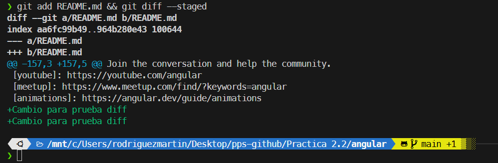

### Captura 4 --> Comando: `git diff --name-only HEAD~5 HEAD`

El --name-only sirve para comparar los cambios (ficheros añadidos, modifiados, eliminados) de algo en specifico, en este caso estamos comparando los cambios etre la capecera acrual y la cabecera 5 pasos atras.

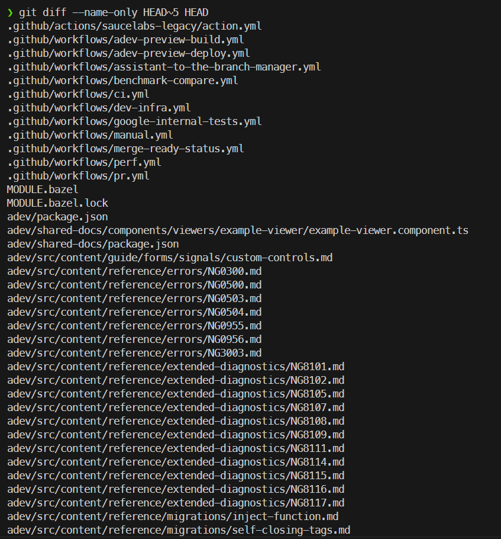

## GIT SHOW

### Captura 1 --> Comando: `git show`
git show sin ninguna opcion, muestra los cambios realizados en el ultimo commit del HEAD actual.

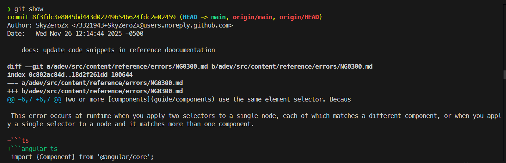

### Captura 2 --> Comando: `git show <hash>`

Tambien podemos hacer git shows a partir de hash en este ejmplo utilizamos el hash de un comitt previo para ver la informacion

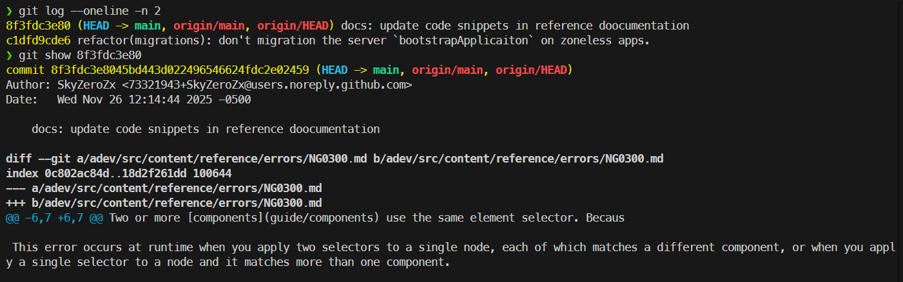

### Captura 3 --> Comando: `git show --stat HEAD`

La opción `--stat` modifica el comportamiento de git show para ocultar el código y mostrar en su lugar un resumen de los archivos afectados y la cantidad de líneas insertadas o eliminadas.

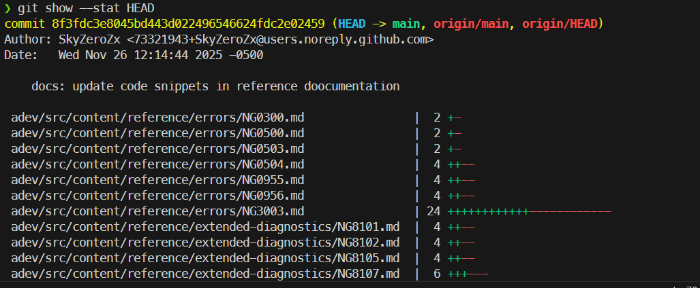

### Captura 4 --> Comando: `git show 15.0.0`

Tambien podemos usar git show con versiones especificas, al estar con un proyecto real y muy laureado como angular he elegido la version `15.0.0` para hacer el git show y ver toda la informacion de la misma.

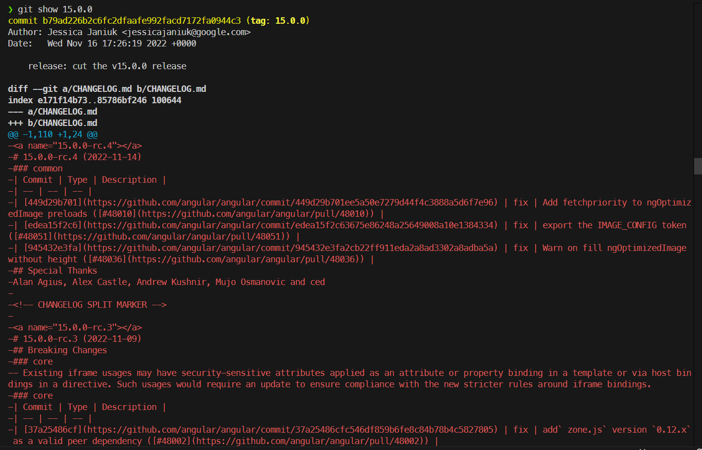

## GIT BLAME
### Captura 1 --> Comando: `git blame -L 1,10 README.md`
Sirve para saber quién escribió cada línea específica de un archivo y en qué commit lo hizo.

En este caso el comando nos muestra quien ha escrito  y el que , las primeras diez lineas del fichero README.

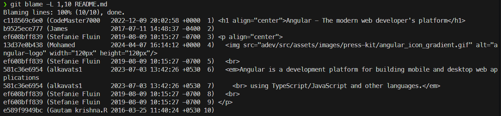

### Captura 2 --> Comando: `git blame -e -L 1,10 README.md`

En este caso he usado la opcion:

`-e`: sustituye el nombre del autor por su dirección de correo electrónico asociada. Esto es vital en equipos grandes para contactar inequívocamente con el responsable de una línea de código.

Como podemos ver en comparacion con la imagen de arriba en vez de los nombresnos salen los correos electronicos.

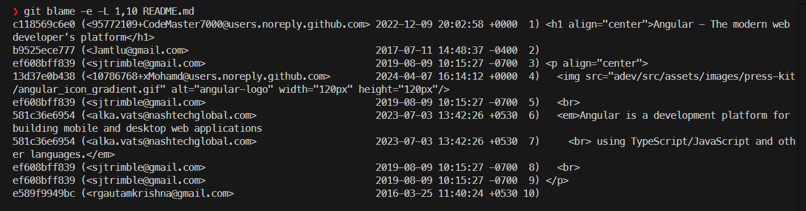

### Captura 3 --> Comando: `git blame -l -L 1,10 README.md`
 El comando con la opcion:

 -l: Noa puestra el hash especifico del commit donde se ha hecho la modificacion.

 En este caso nos muestra las diez primeras lineas del readme.md y los commits donde se añadieron.

 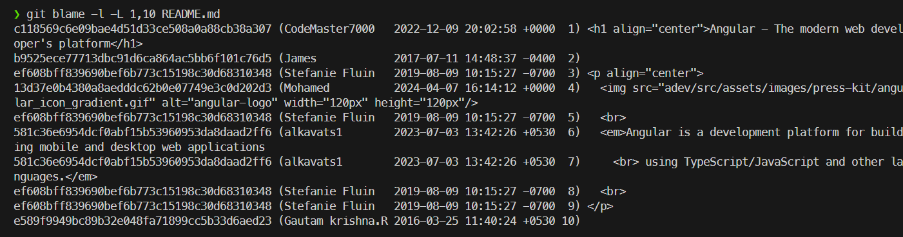

 ### Captura 4 --> Comando: `git blame --date=short -L 1,10 README.md`

 Con la opcion `--date=short` como bien dice el nombre acorta el formato de la fecha.

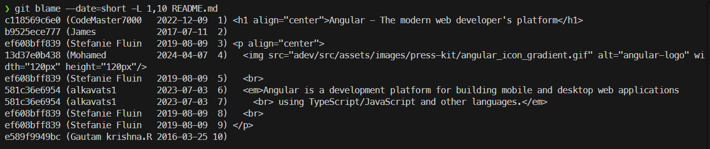