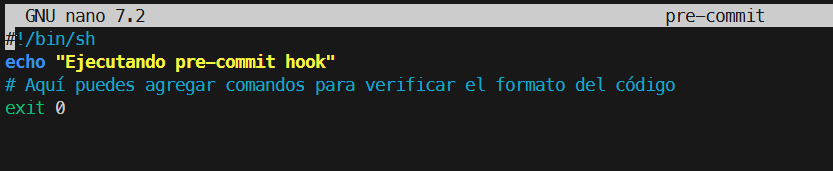
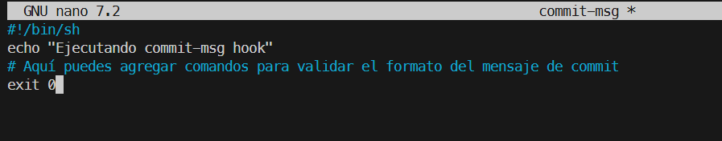
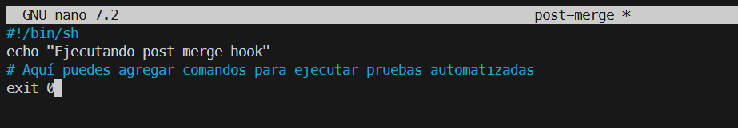
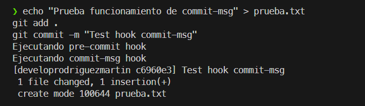
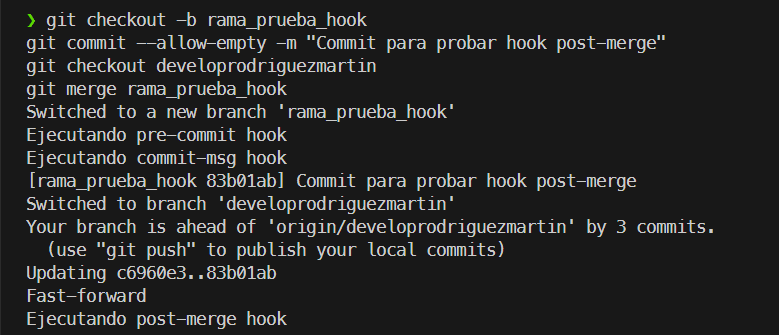

# 03-hooks-nativos-git/

Para la configuracion de estos script nos tenemos que ir al directorio .git/hooks donde crearemos los hooks y pegaremos el codigo que se nos ha dado.

### pre-commit

### commit-msg

### post-merge

## Comprobaciones
Para comprobar la ejecucion de los hooks de pre-commit y commit-msg lo podemos hacer mediante la realizacion de un commit, viendo si se realizan los `echo` de los scripts en la salida del comanod `git commit`, para el post-merge como dice el nombre tendremos que unir dos ramas y una vez se unan se ejecutara.

### pre-commit y commit-msg
Vemos que se ejecutan los `echo` por lo que se ha ejecutado de manera correcta.

## post-merge

Bueno pra el merge he creado una rama de prueba llamada rama_prueba_hook donde he hecho un commit vacio ya que es solo para comprobar el hook, despues he vuelto a la rapa develop y la he unido con rama_prueba_hook ahi es cuando se ha ejecutado el hook.

