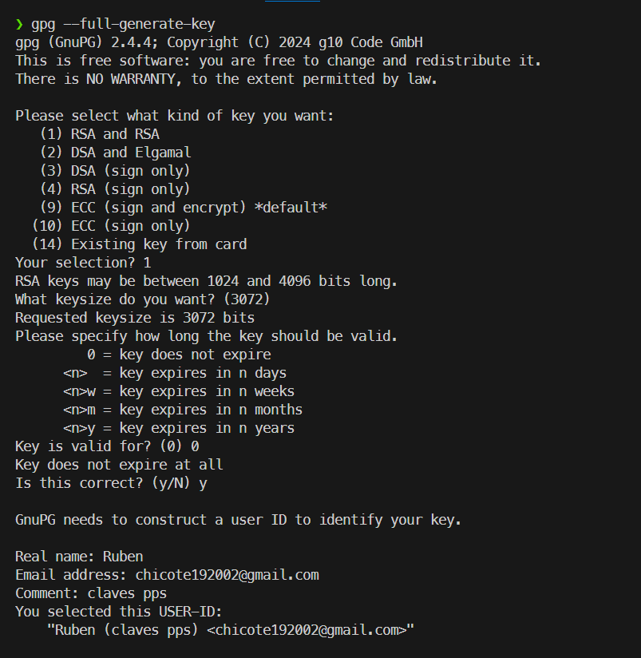
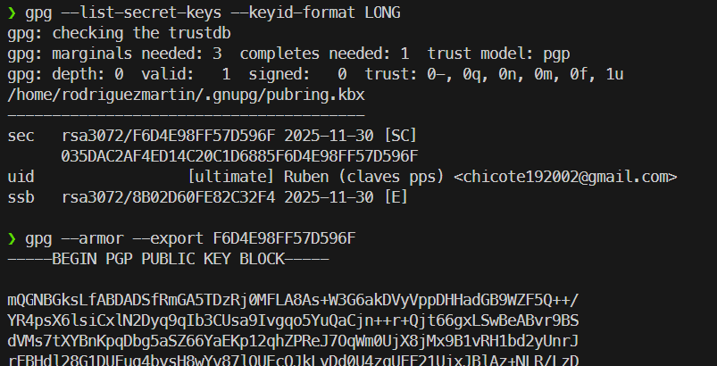
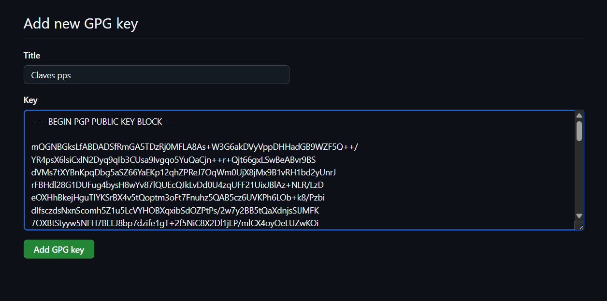
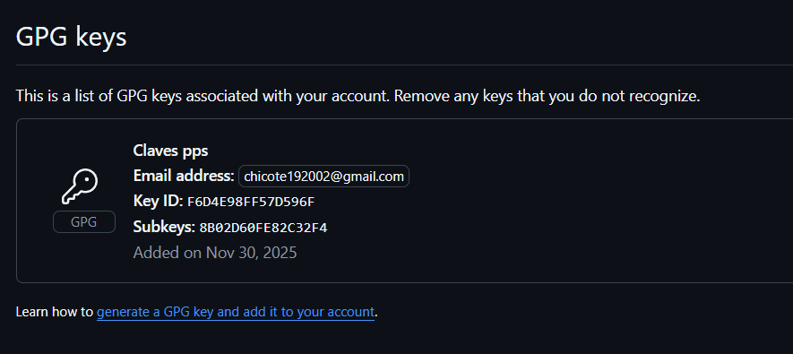
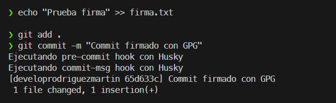
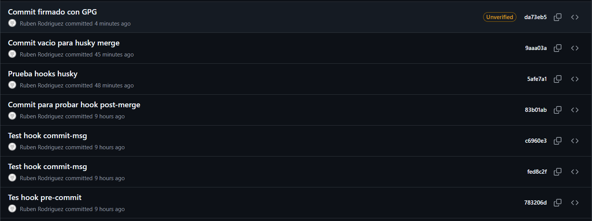

# 05-firma-commits-gpg

## Generar Claves
Comenzamos generando el par de claves GPG que utilizaremos para firmar digitalmente nuestros commits.

## Exportar e Importar claves a GitHub
Para vincular nuestra identidad local con GitHub, primero obtenemos el ID de nuestra clave privada ejecutando `gpg --list-secret-keys --keyid-format LONG`. El ID se encuentra justo después de `rsa3072/` (en este caso: **F6D4E98FF57D596F**).

A continuación, exportamos la clave pública con el comando `gpg --armor --export F6D4E98FF57D596F`. Este comando genera un bloque de texto que copiamos y pegamos en la configuración de nuestra cuenta de GitHub, en la sección `Settings > SSH and GPG keys > New GPG key`.

## Activar Claves en Git
Mediante los siguientes comandos, configuramos Git localmente para que utilice el ID de nuestra clave al firmar y activamos la firma automática para todos los futuros commits.

## Prueba de funcionamiento
Realizamos un commit de prueba. Como se observa en la salida de la terminal, el commit se ha realizado correctamente utilizando la firma GPG configurada.

Al verificar el historial de commits en la interfaz web de GitHub, podemos observar que el commit aparece con una etiqueta de verificación. Aunque en este caso muestra "Unverified" debido a una discrepancia en el correo electrónico asociado a la clave, la presencia de la etiqueta confirma que el proceso de firma digital se ha llevado a cabo correctamente y que GitHub ha reconocido la firma.

