# Practica 2.3 
Para empezar la practica primero hemos creado un directorio de trabajo, hemos iniciado git y hemos creado la rama masterrodriguezmartin.

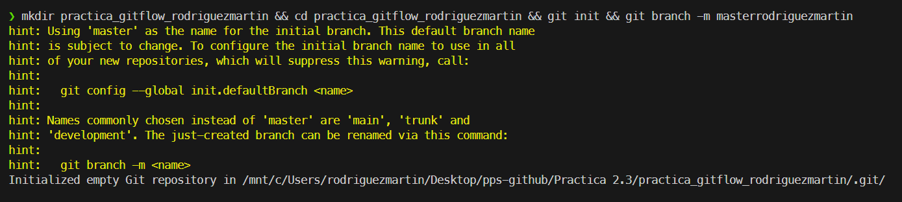

## C1 
Para este commit primero hemos ejecutado:
- `echo "console.log('Inicio');" > index.js`:Este comando metera una linea de codigo js en index.js, 
- `echo "*.log" > .gitignore`: Este comando crea el .gitignore e ignora todso los archivos acabados en .log despues probaremos su eficazia.
- `git add .`: Añadimos los cambios
- `git commit -m "C1-rodriguezmartin: Base del proyecto"`: Ejecutamos el commit C1 con el nombre: C1-rodriguezmartin: Base del proyecto

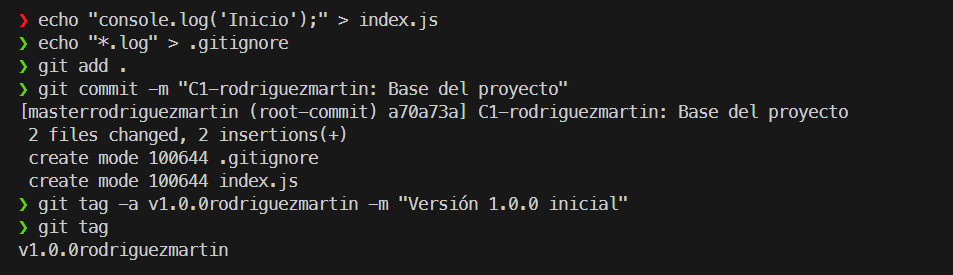

## C2

-  `git checkout -b developrodriguezmartin`:
    - `checkout`: Sirve para de rama.
    - `b`: crea la rama a la que nos hemos cambiado si no exite.

- `echo "// Estamos en develop" >> index.js`: Modificamos el index.js
- `git add .`: 
- `git commit -m "C2-rodriguezmartin: Creacion de develop"`: Realizamos el segundo commit con nombre: C2-rodriguezmartin Creacion de develop

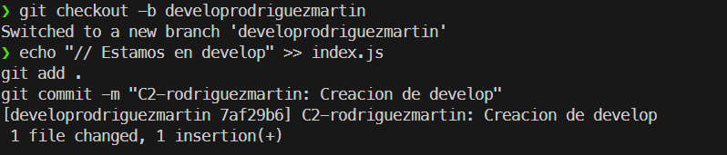

## C3

- `git checkout -b graph_employeerodriguezmartin`: Creamos una rama nueva llamada `graph_employee` y nos cambiamos a ella.
- `echo "// Codigo para graficos" > graficos.js`: Creamos graficos.js.
- `git add .`: Añadimos el archivo al área de preparación.
- `git commit --author="Programador2 <p2@test.com>" -m "C3-rodriguezmartin: Graficos empleado"`: Hacemos el commit usando la opción `--author` para simular que este trabajo lo ha realizado otra persona.

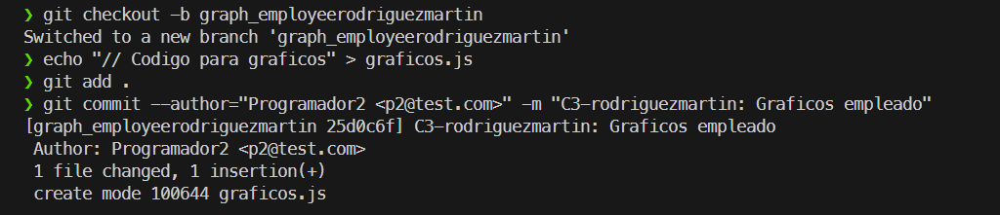

## C4

- `git checkout masterrodriguezmartin`: Volvemos a la rama master.
- `git checkout -b hotfix-negative-timerodriguezmartin`: Creamos la rama hotfix y nos cambiamos a ella.
- `echo "// Arreglo..." > fix.js` y `git add .`: Creamos el archivo del parche y lo preparamos.
- `git commit -m "C4-rodriguezmartin: Hotfix tiempo negativo"`: Hacemos el commit con el arreglo.

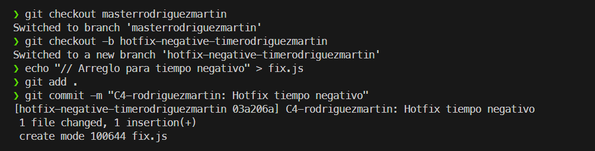

## C5
- `git checkout masterrodriguezmartin`: Nos situamos en la rama master.
- `git merge --no-ff hotfix-negative-timerodriguezmartin`: Fusionamos la rama hotfix en master. Usamos `--no-ff` para que quede constancia de la rama en el historial.
- `git tag -a v1.0.1rodriguezmartin -m "Versión 1.0.1 con hotfix"`: Creamos la etiqueta de la nueva versión.

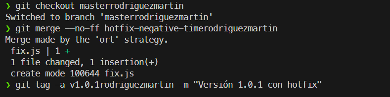

## C6
- `git checkout developrodriguezmartin`: Nos cambiamos a la rama develop.
- `git merge --no-ff hotfix-negative-timerodriguezmartin`: Integramos el arreglo también en develop para mantenerla sincronizada con los arreglos de producción.

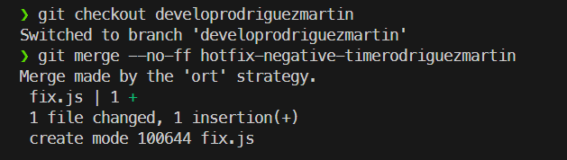

## C7
- `git checkout -b task_typerodriguezmartin`: Partimos de develop y creamos una nueva rama para la funcionalidad de tareas.
- `echo "// Lista..." > tareas.js` y `git add .`: Creamos el archivo y preparamos los cambios.
- `git commit -m "C7-rodriguezmartin: Añadir tipos de tareas"`: Guardamos el primer avance de esta funcionalidad.

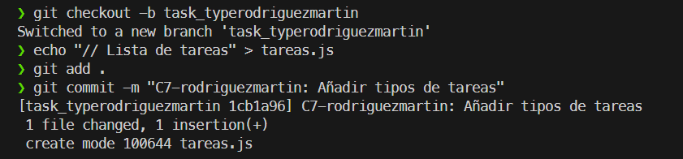

## C8
- `git checkout graph_employeerodriguezmartin`: Regresamos a la rama de gráficos.
- `echo "// Finalizando..." >> graficos.js` y `git add .`: Añadimos el código de esta funcionalidad.
- `git commit --author="Programador2 <p2@test.com>" -m "C8-rodriguezmartin: Finalizando graficos"`: Hacemos el último commit de la rama, de nuevo simulando al Programador 2.

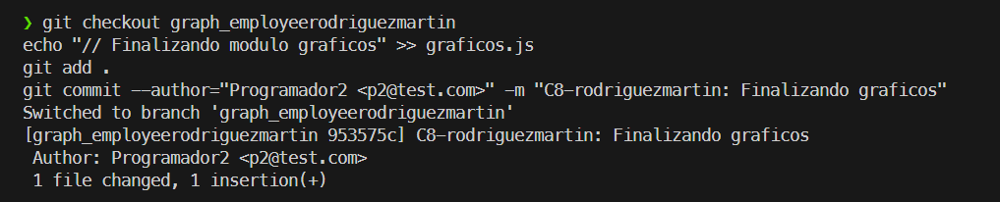

## C9
- `git checkout developrodriguezmartin`: Volvemos a la rama principal de desarrollo.
- `git merge --no-ff graph_employeerodriguezmartin`: Integramos la funcionalidad de gráficos.
- `git branch -d graph_employeerodriguezmartin`: Borramos la rama de gráficos.

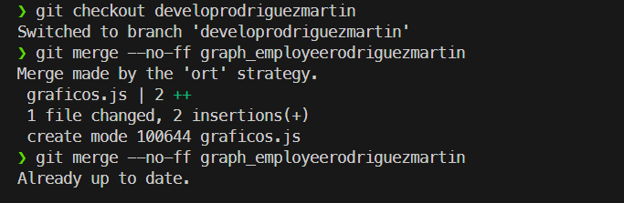

## C10
- `git checkout task_typerodriguezmartin`: Regresamos a la rama de tareas para finalizar el desarrollo.
- `echo "// Finalizando..." >> tareas.js` y `git add .`: Añadimos el código final al archivo de tareas.
- `git commit -m "C10-rodriguezmartin: Finalizando tipos de tareas"`: Realizamos el commit final de la funcionalidad.
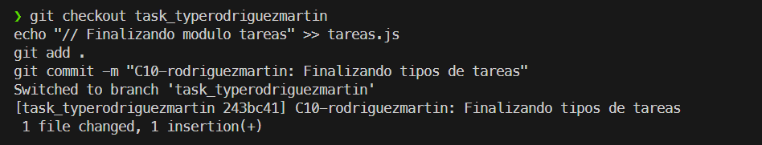

## C11
- `git checkout developrodriguezmartin`: Nos situamos en la rama develop.
- `git merge --no-ff task_typerodriguezmartin`: Fusionamos la rama de tareas completada dentro de develop.

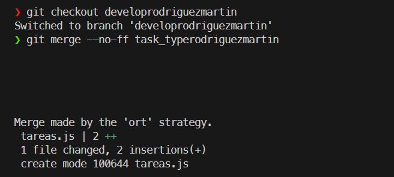

## C12
- `git checkout -b release-V1.1rodriguezmartin`: Creamos una rama de lanzamiento (release) a partir de develop para preparar la versión 1.1.
- `echo "v1.1-RC" > version.txt`: Creamos un archivo indicando la versión.
- `git commit -m "C12-rodriguezmartin: Inicio Release v1.1"`: Guardamos el inicio de la preparación de la release.

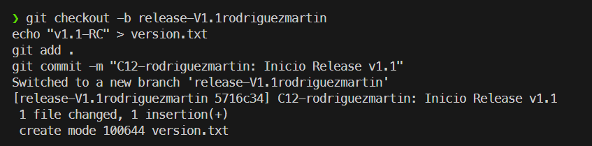

## C13
- `git checkout developrodriguezmartin`: Volvemos a develop.
- `git checkout -b export_csvrodriguezmartin`: Creamos la rama para la exportación CSV.
- `echo "// Modulo CSV" > export.js` y `git add .`: Creamos el archivo de la funcionalidad.
- `git commit -m "C13-rodriguezmartin: Funcionalidad Exportar CSV"`: Guardamos el trabajo inicial de CSV.

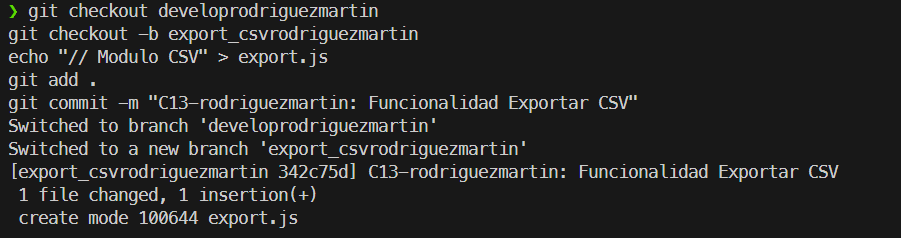

## C14
- `git checkout release-V1.1rodriguezmartin`: Nos movemos a la rama release para corregir un fallo detectado.
- `echo "// Bugfix..." >> graficos.js` y `git add .`: Aplicamos la corrección en el archivo de gráficos.
- `git commit -m "C14-rodriguezmartin: Bugfix grafico en release"`: Guardamos el arreglo en la versión candidata.

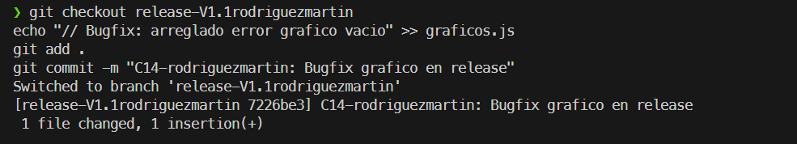

## C15
- `git checkout masterrodriguezmartin`: Volvemos a la rama master para publicar la versión.
- `git merge --no-ff release-V1.1rodriguezmartin`: Fusionamos la rama release con la versión definitiva.
- `git tag -a v1.1rodriguezmartin -m "Versión 1.1 Oficial"`: Etiquetamos el commit como la versión 1.1.

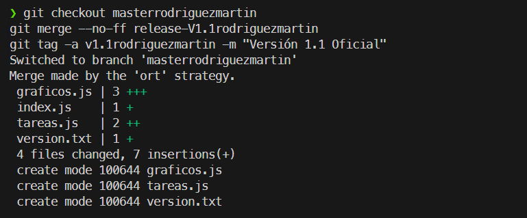

## C16
- `git checkout developrodriguezmartin`: Regresamos a develop.
- `git merge --no-ff release-V1.1rodriguezmartin`: Sincronizamos develop con los cambios finales de la versión 1.1 (incluyendo el bugfix) para no perderlos en el futuro.

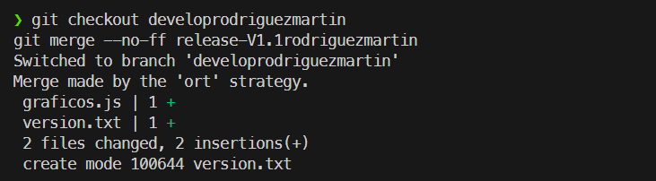

## C17
- `git checkout export_csvrodriguezmartin`: Volvemos a la rama de exportación CSV.
- `echo "// Finalizando..." >> export.js` y `git add .`: Completamos el código de la funcionalidad.
- `git commit -m "C17-rodriguezmartin: Finalizando export_csv"`: Hacemos el último commit de esta rama.

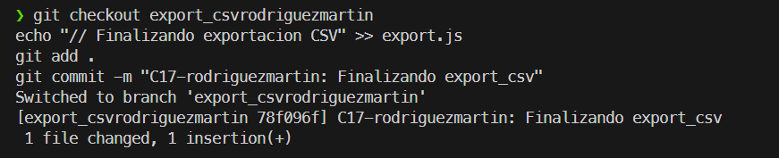

## C18
- `git checkout developrodriguezmartin`: Volvemos a develop para la integración final.
- `git merge --no-ff export_csvrodriguezmartin`: Fusionamos la última funcionalidad pendiente. Con esto, el ciclo de trabajo simulado ha terminado.

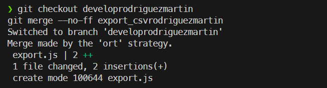

## Subida de repositorio a github

### Comandos

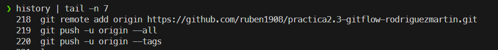

### Repositorio subido

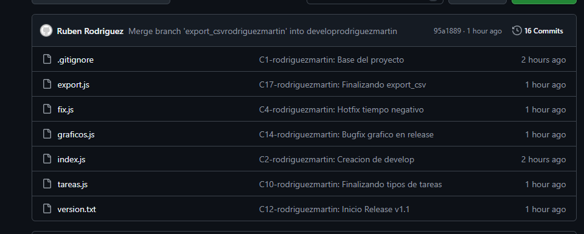

### Ramas

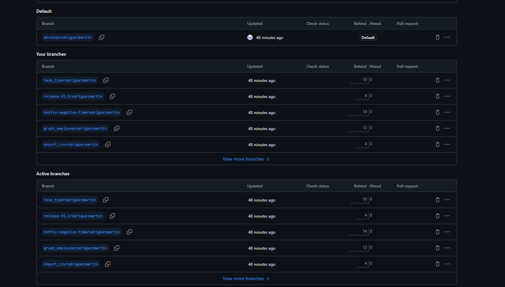

## Demostracion .gitignore

Para verificar que las reglas de exclusión funcionan correctamente, hemos simulado la creación de archivos que **NO** deberían subirse al repositorio:

- `mkdir node_modules`: Creamos una carpeta para simular las librerías externas pesadas del proyecto.
- `echo ... > node_modules/libreria_pesada.js`: Creamos un archivo falso dentro de esa carpeta para probar que Git ignora el directorio completo.
- `echo "PASSWORD=12345" > .env`: Simulamos un archivo sensible con contraseñas.
- `echo "Basura de Mac" > .DS_Store`: Simulamos un archivo de sistema innecesario.
- `echo "Log..." > error_sistema.log`: Creamos un archivo de registro (log).

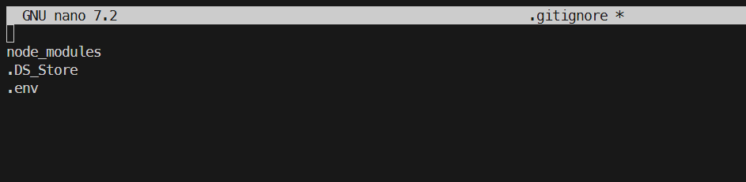

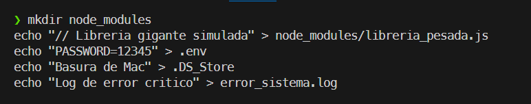

Realizando un git status podemos ver como ignora completamente los cambios que hemos hechos en los ficheros y en la creacion de carpetas anteriores.

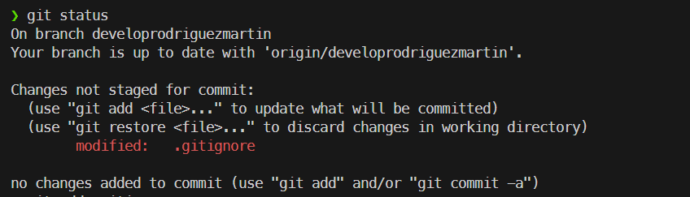

## Creacion de fichero mediante github web
He creado el fichero README.md rn la rama developrodriguezmartin

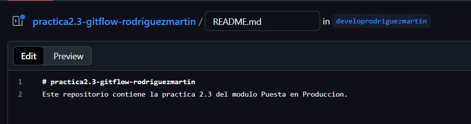

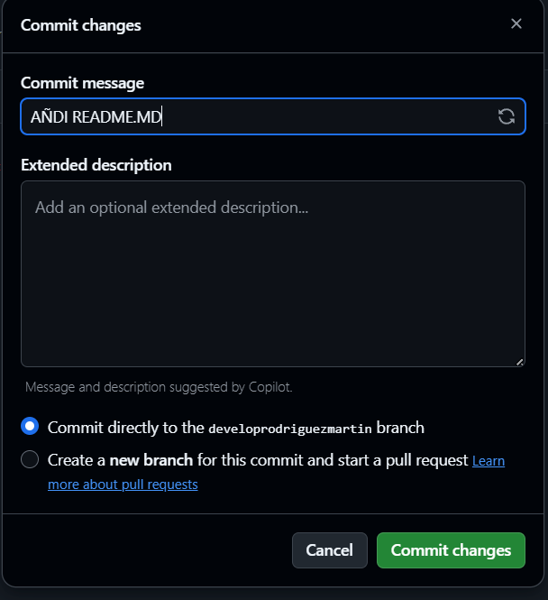

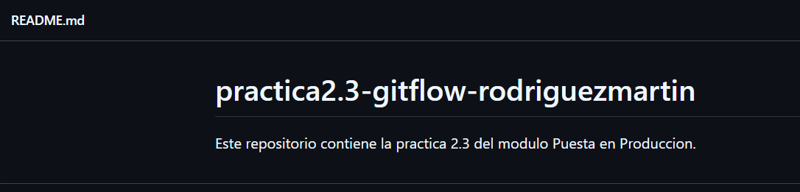

## Comprobacion de Tags

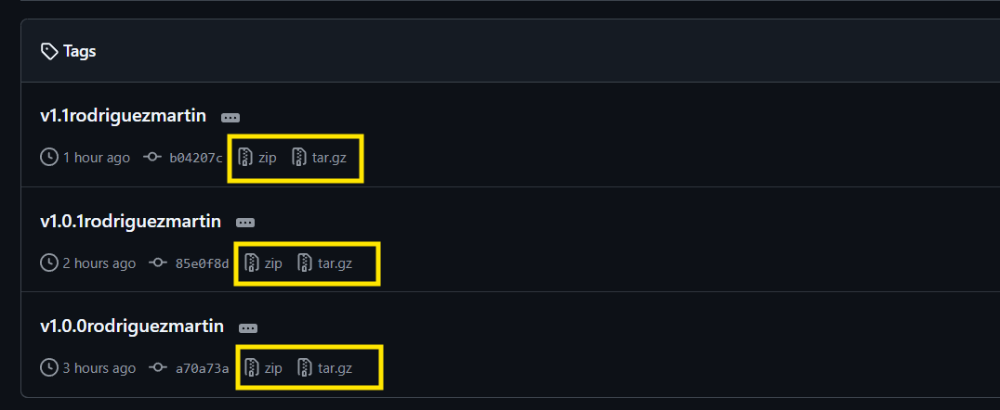

## Grafico GitHub y Source Tree

### GitHub Insights

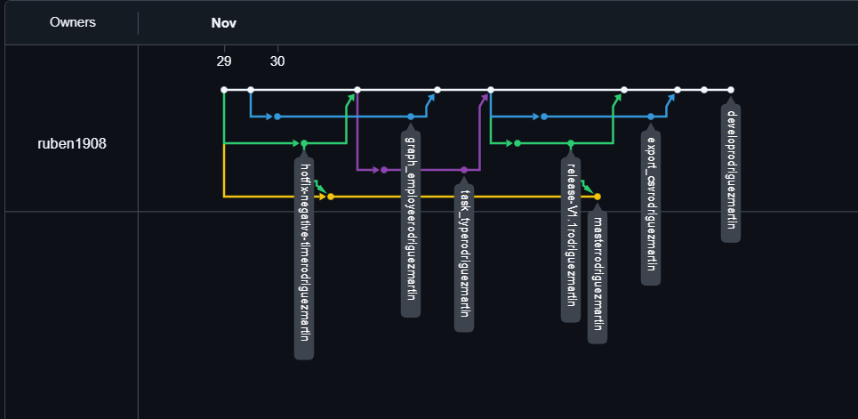

### Source Tree

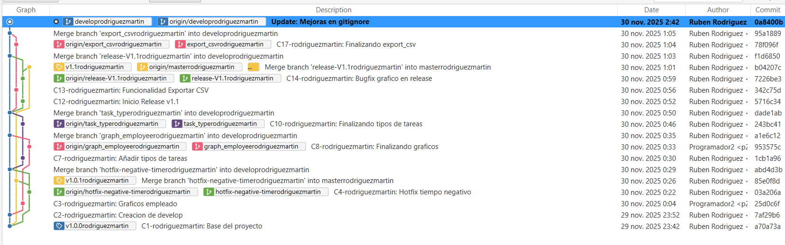