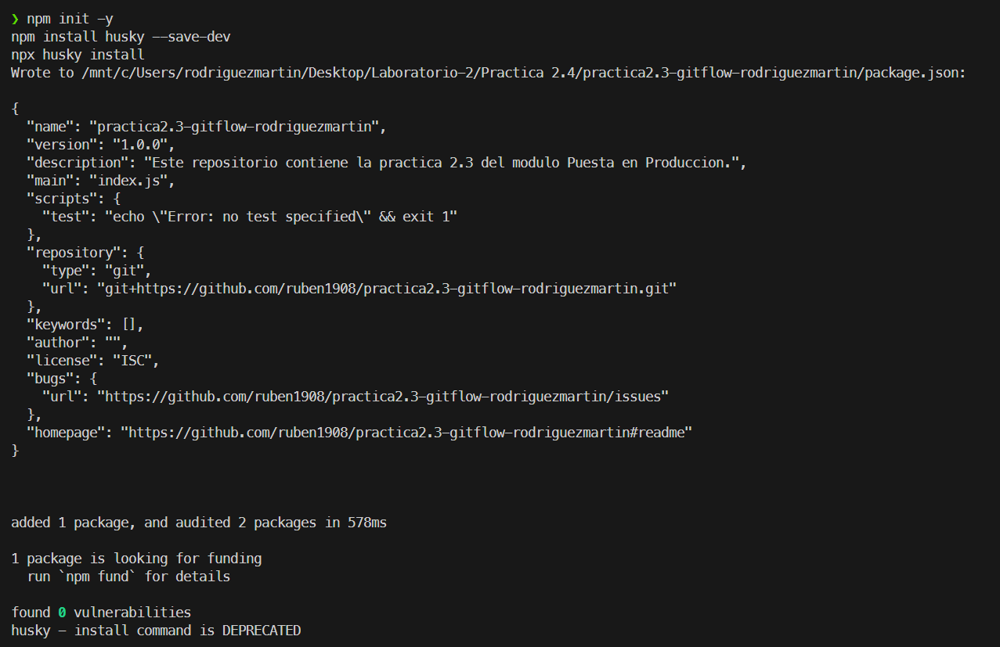
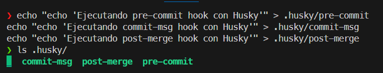
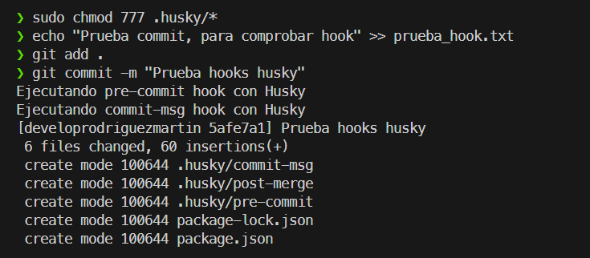
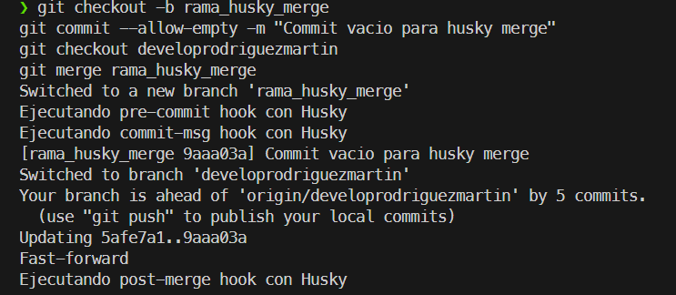

# Práctica 2.5: Hooks con Husky

## Instalación de Husky
Para instalar Husky, utilizaremos el gestor de paquetes npm. Ejecutamos los comandos necesarios para inicializar el proyecto e instalar la herramienta.

## Preparación de Scripts
Debido a actualizaciones en la versión de Husky, el comando `husky add` mencionado en la guía ha quedado obsoleto. Para configurar los hooks, hemos creado manualmente los archivos de script correspondientes dentro de la carpeta `.husky`.

## Comprobaciones de funcionalidad de Scripts
Al igual que en la práctica anterior, verificaremos el funcionamiento de los hooks `pre-commit` y `commit-msg` mediante la realización de un commit, y el hook `post-merge` fusionando dos ramas.

Tras otorgar permisos de ejecución a los scripts, realizamos un cambio de prueba, lo añadimos al área de preparación (staging area) y ejecutamos el commit. Los mensajes (`echo`) en la salida confirman que ambos hooks se ejecutan correctamente.

Para el hook `post-merge`, seguimos el mismo procedimiento de comprobación que en el ejercicio anterior (fusión de una rama de prueba), confirmando su ejecución tras el merge.

