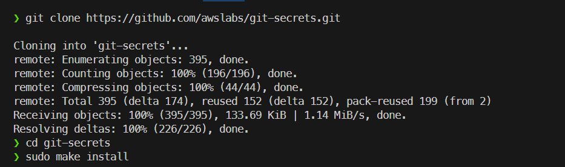
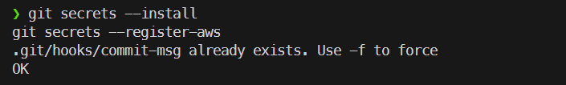
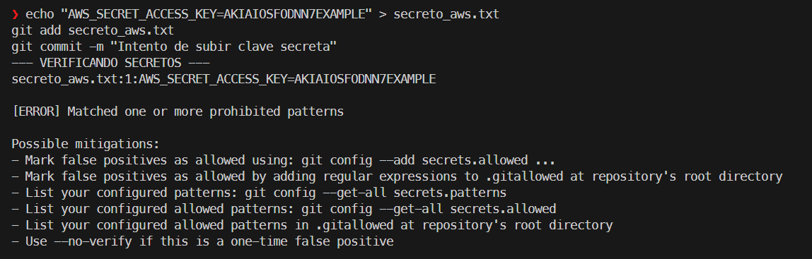
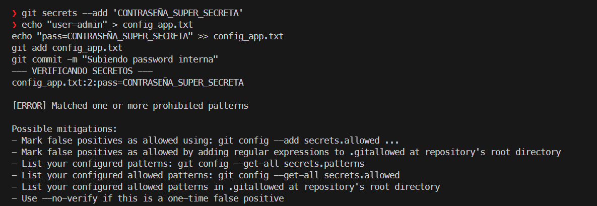

# Práctica 2.7: Securizando GIT con Git-Secrets

## Instalación de git-secrets
Realizamos la instalación desde el repositorio oficial siguiendo la documentación del proveedor:

1. Clonamos el repositorio.
2. Accedemos al directorio descargado.
3. Ejecutamos `sudo make install` para instalarlo en el sistema.

Una vez instalada la herramienta en el sistema operativo, procedemos a activarla y configurarla en nuestro repositorio local:

- `git secrets --install`: Instala los hooks de seguridad en el repositorio actual.
- `git secrets --register-aws`: Añade los patrones de detección de claves de Amazon AWS.

## Prueba de Funcionamiento (Bloqueo AWS)
Para verificar la protección, simulamos la creación de un archivo que contiene una clave ficticia de AWS. El objetivo es comprobar que, al intentar realizar el commit, el sistema detecta el patrón prohibido y bloquea la operación, mostrando un error.

## Configuración de Patrones Personalizados
Además de proteger contra claves de AWS, `git-secrets` permite añadir reglas para bloquear cadenas de texto específicas (como contraseñas internas). En este caso, configuramos el bloqueo para cualquier archivo que contenga la cadena "CONTRASEÑA_SUPER_SECRETA".

- `git secrets --add 'CONTRASEÑA_SUPER_SECRETA'`: Añadimos la regla global para prohibir este patrón.
- `echo "user=admin" > config_app.txt`: Creamos un archivo de configuración simulado.
- `echo "pass=CONTRASEÑA_SUPER_SECRETA" >> config_app.txt`: Insertamos la contraseña prohibida en el archivo.
- `git add config_app.txt`: Añadimos el archivo al área de preparación.
- `git commit -m "Subiendo password interna"`: Intentamos realizar el commit.

Como se observa en la captura, el sistema devuelve un error y rechaza el commit del archivo `config_app.txt`, cumpliendo con la política de seguridad establecida.

