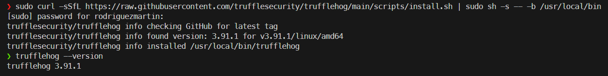
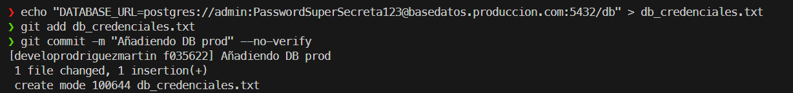
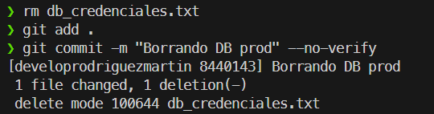
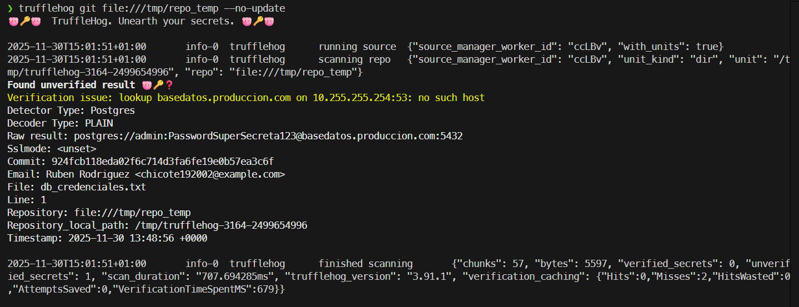
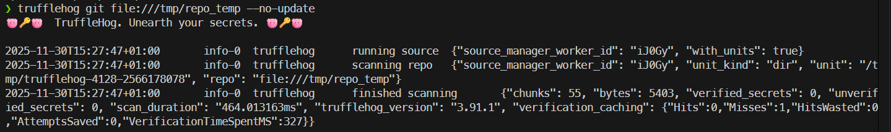

# Práctica 2.8: Auditoría Forense de Credenciales con TruffleHog (Local)

## Instalación de TruffleHog
Instalamos la versión más moderna de TruffleHog (v3) directamente en el sistema operativo.



## Prueba de Funcionalidad y Detección
Simulamos un escenario de filtración de **credenciales** (una cadena de conexión a base de datos de PostgreSQL) para demostrar que, aunque el archivo se borre, el secreto persiste en el historial.

**Justificación Técnica:** Se eligió un patrón URI de Base de Datos para forzar la detección por sintaxis, ya que los ejemplos conocidos (como las claves de AWS) suelen ser ignorados por la inteligencia de TruffleHog (v3).

### 1. Inyección de Credencial
Simulamos el error humano subiendo un archivo con la credencial, utilizando `--no-verify` para saltar los hooks de seguridad de la Práctica 2.7.



### 2. Ocultación del Rastro
Inmediatamente después, el desarrollador elimina el archivo del disco y guarda el commit de borrado.



### 3. Escaneo Inicial y Detección
Lanzamos TruffleHog contra la copia temporal del repositorio (para evitar el error de ruta de WSL).

**Comando:** `trufflehog git file:///tmp/repo_temp --no-update`

**Resultado del escaneo (Análisis):**
TruffleHog detecta el peligro, identificando el **Detector Type: Postgres** y mostrando la credencial expuesta en un commit que ya no es el más reciente.



---

## 2.8 Verificación Final

**Objetivo:** Eliminar permanentemente la credencial del historial (tal como lo pide el enunciado).

1.  **Reescritura del Historial:** Utilizamos la herramienta `git filter-repo` para reescribir la historia, eliminando el rastro del archivo `db_credenciales.txt` de todos los commits.

    *Comandos usados:*
    ```bash
    git filter-repo --path db_credenciales.txt --invert-paths --force
    git push --force
    ```

2.  **Verificación Final de la Eliminación (Local):**
    Una vez reescrita la historia, verificamos que TruffleHog ya no encuentra la credencial en el repositorio local limpio.

    **Resultado:** El escaneo debe salir completamente vacío (`unverified_secrets: 0`).

 


