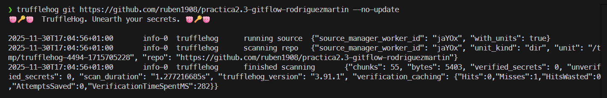
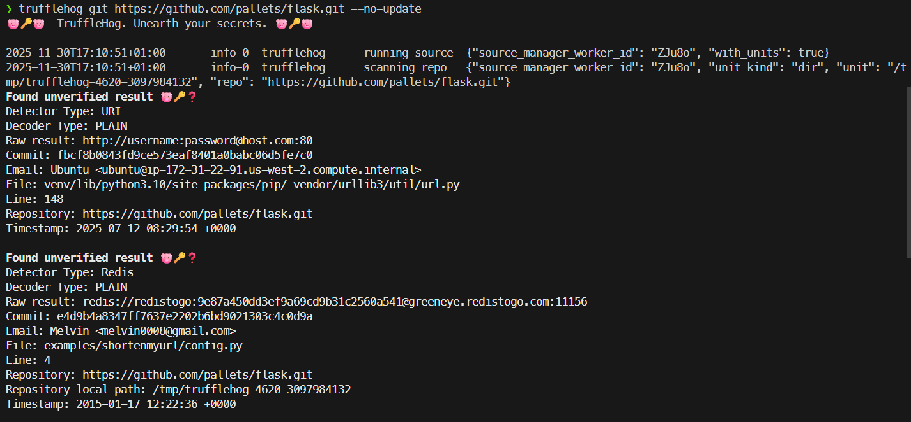
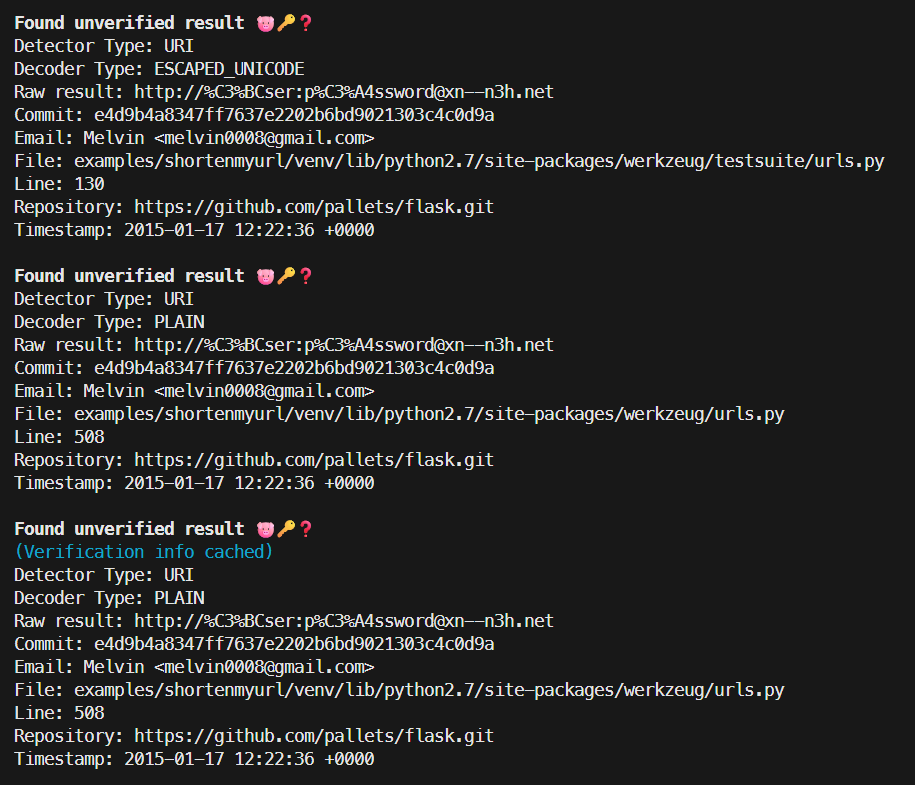
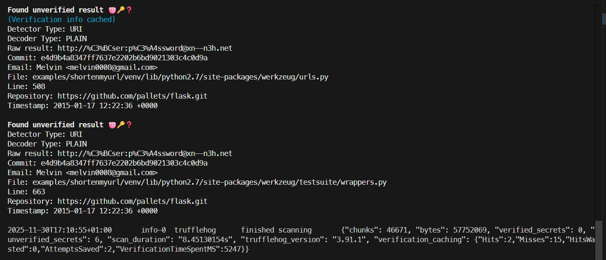
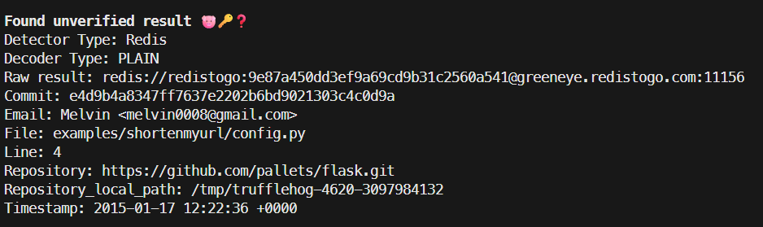

# Practica 2.9

Para esta practica vamos a usar trafflehog pero destinado a repositorios remotos
El comando es practicamente el mismo que en el ejercicicio anterior, lo unico que cambia es la ruta en la que la herramineta busca que en este caso es la de un repositorio remoto.

```bash
trufflehog git https://github.com/ruben1908/practica2.3-gitflow-rodriguezmartin --no-update
```
Hemos usado el repositorio que llevamos trabajando a lo largo de toda la actividad, debido al resulado de la practica anterior el repositorio esta limpio y libre de vulnerabilidades.



## Ejemplocon repositorio remoto externo
Para comprobar que la herramienta funciona perfectamente en repositorios que no sean de neustra propiedad lo voy a ejecutar en el repositorio de flask.







De hecho la herramienta ha encontrado diversas credenciales y datos sensibles en commits que datan de hace más de 10 años.

La mayoria son falsos positivos de ejemplo de ficheros de configuracion, pero este especificamente, es bastante raro ya que parece mostrar, un usuario y contraseña reales



El dominio no esta activo, por lo que no supone una vulnerabilidad explotables.